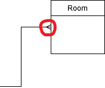

# Tài liệu Cơ sở dữ liệu môn Công nghệ Client Server

## Sơ đồ tổng quan

Một cách đơn giản nhất, cơ sở dữ liệu cho môn Client Server được thiết kế như sau:

| Tên tiếng Anh | Nghĩa tiếng Việt | Giải thích                                                                          |
|---------------|------------------|-------------------------------------------------------------------------------------|
| Customer      | Khách hàng       | Lưu lại thông tin của khách hàng                                                    |
| Account       | Tài khoản        | Lưu lại thông tin đăng nhập, kèm thông tin của nhân viên                            |
| Booking       | Đặt phòng        | Lưu lại thông tin đặt phòng                                                         |
| Invoice       | Hóa đơn          | Lưu lại thông tin các hóa đơn và việc thuê phòng cũng như các dịch vụ trong hóa đơn |
| Service       | Dịch vụ          | Lưu lại thông tin các dịch vụ                                                       |
| Room          | Phòng            | Lưu lại thông tin về các phòng                                                      |

## Giải thích sơ đồ tổng quan

Nối "ba chĩa"  đại diện cho quan hệ một nhiều, nối đơn đại diện cho quan hệ một một.

Theo sơ đồ tổng quan ở trên, có thể diễn giải ra các thông tin sau:

- Một khách hàng có thể là người thanh toán nhiều hóa đơn.
- Một tài khoản/nhân viên có thể là người tạo ra nhiều hóa đơn.
- Trong một hóa đơn có thể thuê nhiều phòng.
- Trong một hóa đơn có thể gọi nhiều dịch vụ.
- Hóa đơn có ánh xạ 1 1 với việc đặt phòng.

## Thiết kế vật lý

Thiết kế vật lý là giai đoạn xác định các bảng, các trường của cơ sở dữ liệu trên một hệ quản trị cơ sở dữ liệu nhất định (ví dụ SQL Server).

Thiết kế vật lý của cơ sở dữ liệu này được thể hiện rõ trong tệp khởi tạo `Initialization.sql`. 
Dữ liệu mẫu được đặt trong tệp `Seed_V1.sql`. Để khởi tạo cơ sở dữ liệu mới hoàn toàn, chỉ cần chạy lần lượt tệp khởi tạo, rồi tệp dữ liệu mẫu.

## Giải thích thiết kế vật lý

### Quy tắc đặt tên

- Tên các bảng được viết bằng tiếng Anh, kiểu mixed (dùng cả chữ in và chữ thường).
- Dùng tên bảng `*_Detail` để đánh dấu các bảng ánh xạ nhiều nhiều.
- Dùng tên cột `Id` để đánh dấu khóa chính.
- Dùng tên cột `*_Id` để đánh dấu khóa ngoại đến các bảng khác.

### Cụ thể về các bảng

| Tên bảng                | Ý nghĩa                                                  |
|-------------------------|----------------------------------------------------------|
| `Menu`                  | Lưu lại thông tin về menu khi làm web?                   |
| `Customer`              | Lưu lại thông tin của khách hàng                         |
| `Account`               | Lưu lại thông tin đăng nhập, kiêm thông tin về nhân viên |
| `Booking`               | Lưu lại thông tin về việc đặt phòng                      |
| `Invoice`               | Lưu lại thông tin về các hóa đơn                         |
| `Service`               | Lưu lại thông tin về các dịch vụ                         |
| `Room`                  | Lưu lại thông tin về các phòng                           |
| `InvoiceService_Detail` | Ánh xạ giữa hóa đơn và các dịch vụ                       |
| `InvoiceRoom_Detail`    | Ánh xạ giữa hóa đơn và các phòng được thuê trong hóa đơn |
| `Booking_Detail`        | Ánh xạ giữa việc đặt trước phòng và các phòng            |

### Một số trường cần lưu ý

| Tên bảng                                      | Tên trường      | Ý nghĩa                                                                                                                                                                               |
|-----------------------------------------------|-----------------|---------------------------------------------------------------------------------------------------------------------------------------------------------------------------------------|
| `Customer`, `Account`                         | `Gender`        | `0` là nữ   `1` là nam                                                                                                                                                             |
| `Booking`                                     | `Status`        | `0` là không tạo thành hóa đơn   `1` là đã tạo thành hóa đơn                                                                                                                       |
| `Invoice`                                     | `TotalPrice`    | Tổng giá hóa đơn được tính sẵn bằng cách cộng tiền thuê phòng và tiền dịch vụ                                                                                                         |
| `Room`                                        | `Status`        | `0` là vẫn còn trống   `1` là đã được dùng   Trường này cập nhật khi có dữ liệu mới trong bảng `InvoiceRoom_Detail`                                                             |
| `InvoiceService_Detail`, `InvoiceRoom_Detail` | `Price`         | Giá tiền của dịch vụ và phòng được lưu thừa để thuận tiện tính toán và không phải xử lý việc thay đổi giá ở bảng gốc                                                                  |
| `InvoiceRoom_Detail`                          | `DayCount`      | Số ngày thuê được tính theo `CheckinDay` (thời điểm khách nhận phòng) và `CheckoutDay` (thời điểm khách trả phòng)                                                                    |
| `Booking_Detail`                              | `DepositAmount` | Số tiền mà khách đã trả trước để đặt cọc   Chú ý rằng khi tính tiền của hóa đơn thì cần hiển thị số tiền phải trả bằng tổng giá/`TotalPrice` trừ đi tổng khoản `DepositAmount` này |